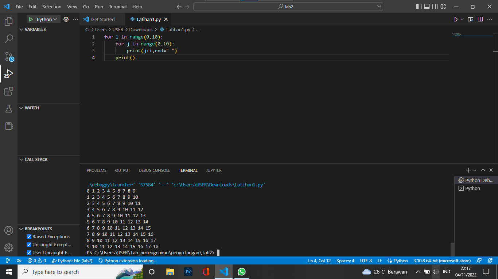
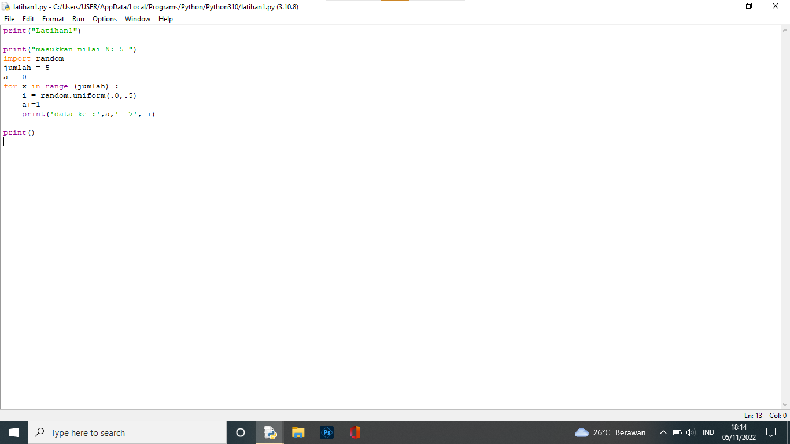
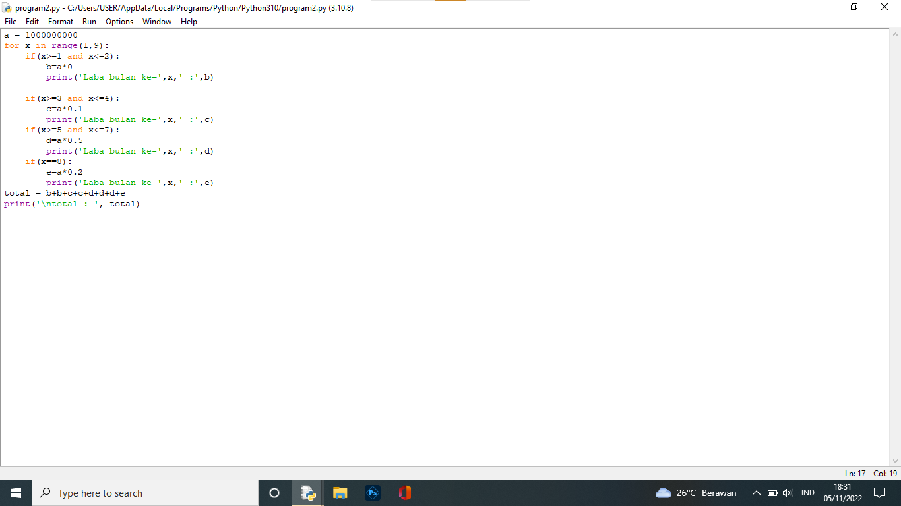

# Labpy03
## Lab 3 pengulangan
### Latihan1

### Latihan2
#### Penjelasan
+ print('Masukan nilai N:5')
+ import random
+ jumlah=5
+ a=0
+ for x in range(jumlah):
+ i = random.uniform(.0,.5)
+ a+=1
+ print('data ke:',a,'==>',i)
+ print()
+ "print":Berfungsii untuk mencetak atau menampilkan objek ke perangkat keluaran atau file teks.
+ "Import":Berfungsi lanjut yang di panggil oleh statement import.
+ "random":untuk menentukan suatu pilihan.
+ "range":nerupakan fungsi yang menghasilkan list. Fungsi ini akan menciptakan sebuah list baru dengan rentang nilai tertentu.
+ "uniform":digunakan untuk menampilkan bilangan float random dengan batas awal bilangan x, dan batas akhir bilangan y.

## Program1
#### penjelasan
+ masukan nilai a
+ gunakan for untuk perulangan 1 sampai 8. perulangan for disebut counted loop (perulangan yang terhitung)
+ lalu gunakan if pertama untuk menentukan laba bulan ke 1 dan ke 2. masukkan variabel (b) kalikan nilai (a) dengan data bulan 1 dan 2. cetak (x) dan (b)
+ lalu gunakan if kedua untuk mementukan laba bulan ke 3 dan bulan ke 4. masukkan variabel (b) kalikan nilai (a) dengan data bulan 3 dan 4. cetak (x) dan (c)
+ lalu gunakan if ketiga untuk mementukan laba bulan ke 5 sampai bulan ke 7. masukkan variabel (b) kalikan nilai (a) dengan data bulan 5 sampai 7. cetak (x) dan (d)
+ lalu gunakan if keempat untuk mementukan laba bulan ke 8. masukkan variabel (b) kalikan nilai (a) dengan data bulan 8. cetak (x) dan (e)
+ lalu total keseluruhan
#### cetak total

